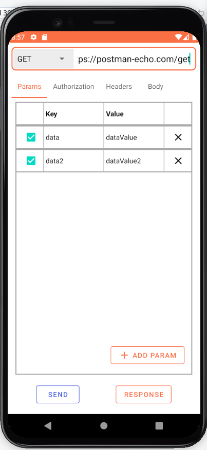
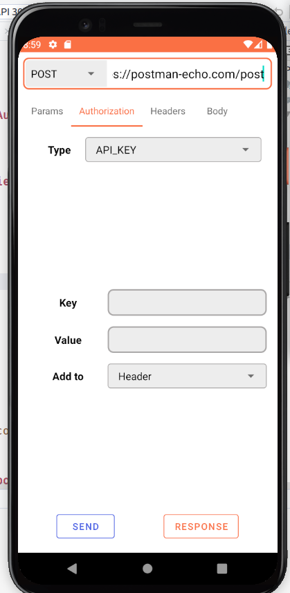
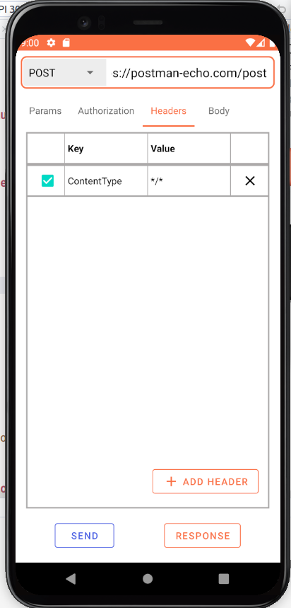
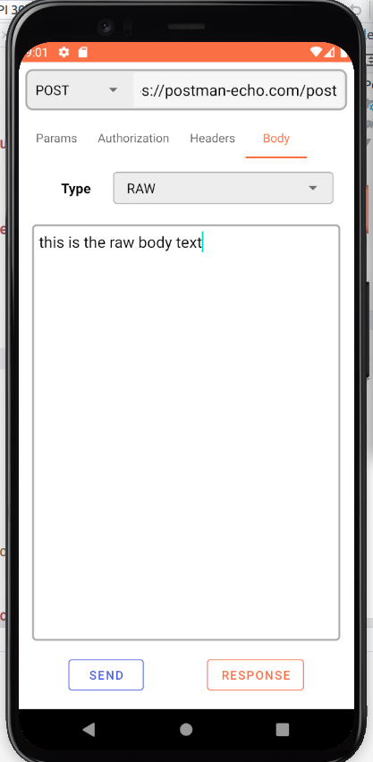
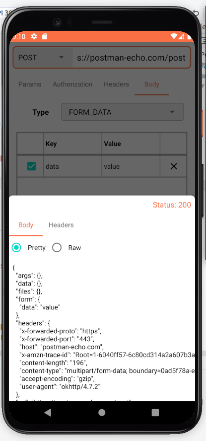
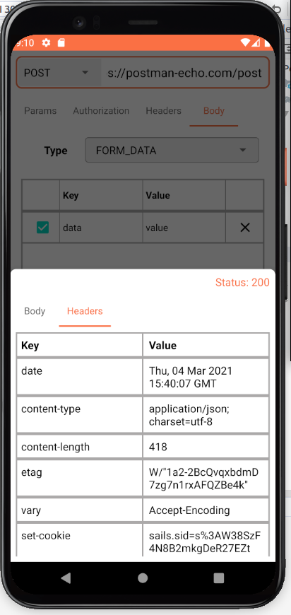

# PostmanAndroidClient

## :construction: :construction: WORK IN PROGRESS :construction: :construction:
## About
Android client for Postman

## Download the debug apk from below

## Currently Building With 🛠
- [Kotlin](https://kotlinlang.org/) - First class and official programming language for Android development.
- [RxJava2](https://github.com/ReactiveX/RxJava/tree/2.x) - Java VM implementation of Reactive Extensions: a library for composing asynchronous and event-based programs by using observable sequences.
- [Android Architecture Components](https://developer.android.com/topic/libraries/architecture) - Collection of libraries that help you design robust, testable, and maintainable apps.
  - [LiveData](https://developer.android.com/topic/libraries/architecture/livedata) - Data objects that notify views when the underlying database changes.
  - [ViewModel](https://developer.android.com/topic/libraries/architecture/viewmodel) - Stores UI-related data that isn't destroyed on UI changes. 
  - [Room](https://developer.android.com/topic/libraries/architecture/room) - SQLite object mapping library.
  
- [Dependency Injection](https://developer.android.com/training/dependency-injection) - 
  - [Dagger2](https://dagger.dev/) - Vanilla Dagger to do dependency injection into an Android application.
  - [Complete Dagger Tutorial](https://blog.mindorks.com/a-complete-guide-to-learn-dagger-2-b4c7a570d99c) - Mindorks Complete Dagger2 tutorial + Dagger Hilt
- [Okhttp3](https://github.com/square/okhttp) - OkHttp3 is an open source project designed to be an efficient HTTP client  
- [Retrofit](https://square.github.io/retrofit/) - A type-safe HTTP client for Android and Java.
- [Moshi](https://github.com/square/moshi) - A Java serialization/deserialization library to convert Java Objects into JSON and back 
- [Material Components for Android](https://github.com/material-components/material-components-android) - Modular and customizable Material Design UI components for Android.

## Architecture
This app uses [***MVVM (Model View View-Model)***](https://developer.android.com/jetpack/docs/guide#recommended-app-arch) architecture.

## ScreenShots

| | | |
| --- | --- | --- |
||||

|  |  | |
| --- | --- | --- |
|||

## Tasks Done
- [x] Request Screen
- [x] Add Headers, Params, Body, Authorization to Request

## TODOs
- [ ] Integrate [Postman Api](api.postman.com) for Collections, Environment, Api
- [ ] Add Collections Section
- [ ] Add Environment Section and integrate it with Request Screen
- [ ] Add Api Section 
- [ ] Add Token based Login (Since Postman api requires token and it can be generated by user only)

